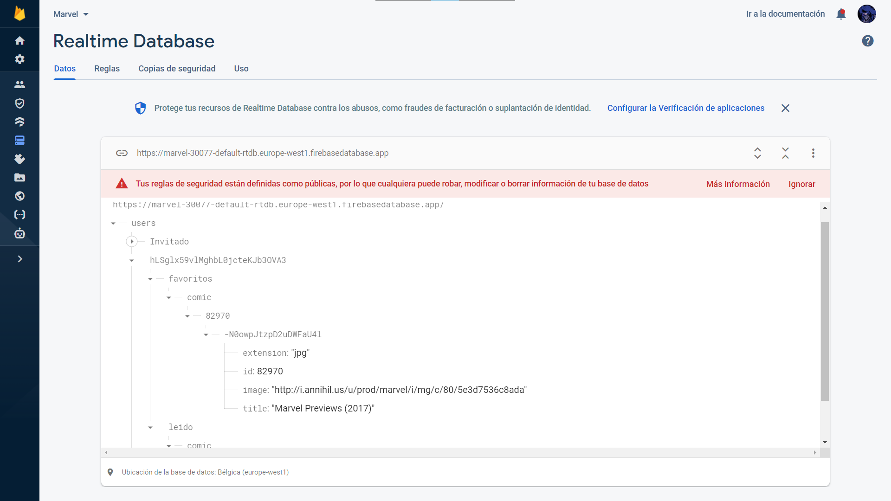

# AlvaroCI

<!--
*** Thanks for checking out the Best-README-Template. If you have a suggestion
*** that would make this better, please fork the repo and create a pull request
*** or simply open an issue with the tag "enhancement".
*** Don't forget to give the project a star!
*** Thanks again! Now go create something AMAZING! :D
-->

<!-- PROJECT LOGO -->
 

  

  <h3 align="center">Learning Frameworks</h3>

  

    An awesome work with differents frameworks but the same API (except Flutter)!
     
    <a href="https://github.com/Practicas-FP/AlvaroCI.git"><strong>Explore the docs »</strong></a>
     
     
    <a href="https://aci-marvel-angular.netlify.app">View Demo of Angular</a>
    ·
    <a href="https://aci-marvel-ionic.netlify.app">View Demo of Ionic</a>
    ·
    <a href="">View Demo of Kotlin</a>
    ·
    <a href="https://github.com/Practicas-FP/AlvaroCI/raw/main/flutter_rick_morty/APK/WikiRick-ACI.apk">Download Flutter APK</a>
  

<!-- TABLE OF CONTENTS -->

  
Table of Contents

  <ol>
    <li>
      <a href="#about-the-project">About The Project</a>
      <a href="#screenshots-project">Screenshots Of The Project</a>
      <ul>
        <li><a href="#built-with">Built With</a></li>
      </ul>
    </li>
    <li><a href="#roadmap">Roadmap</a></li>
    <li><a href="#license">License</a></li>
    <li><a href="#contact">Contact</a></li>
  </ol>

<!-- ABOUT THE PROJECT -->
## About The Project

I've been working with differents frameworks but they have one thing in common, the API. I've choosen the API of Marvel, the official one, because I think
is a curious library for work and learn. It's so complicated to get all data and make a really nice app/web but I kept and I still keeping my best effort for create something new
and intuitive for all the people.

Here's why:
* The UI used is so basic for the user, by the way, the code, is so scalable and intuitive for developers.
* Has been made without any template. Everything is homemade.
* All the registers are save in the same Database, why? for one reason, to be multiplatform.

(<a href="#top">back to top</a>)

<!-- SCREENSHOTS -->
## Screenshots Of The Project
- [x] <a href="https://github.com/Practicas-FP/AlvaroCI/tree/main/Angular">Angular</a>
   
  
  
  
   
  
  
  
   
- [x] <a href="https://github.com/Practicas-FP/AlvaroCI/tree/main/Ionic">Ionic</a>
   
  
  
  
  
   
  
  
  
  
   
  
  
  
   
- [x] Kotlin
  <h1>Under Development</h1>
   

- [x] Flutter
   
  
  
  
  
   
  
  
  
  
   
  
  
  
  
   

(<a href="#top">back to top</a>)

### Built With

Here we have the official documentation of the frameworks that I've been working this few months.

* [Angular](https://angular.io/)
* [Ionic](https://ionic.io/)
* [Kotlin](https://developer.android.com/kotlin/first?hl=es-419)
* [Flutter](https://docs.flutter.dev/)

(<a href="#top">back to top</a>)

<!-- ROADMAP -->
## Roadmap

- [x] Add Changelog
- [x] Add back to top links
- [x] Add "components" document to easily copy & paste sections of the readme
- [x] Multi-language Support
    - [x] English (Unique idiom in Angular, Ionic and Flutter)
    - [x] Spanish

(<a href="#top">back to top</a>)

<!-- LICENSE -->
## License

Distributed under the MIT License. See `LICENSE.txt` for more information.

(<a href="#top">back to top</a>)

<!-- CONTACT -->
## Contact

Alvaro C.I - - aljusca@gmail.com

Project Link: [[https://github.com/Practicas-FP/AlvaroCI.git](https://github.com/Practicas-FP/AlvaroCI.git)]

(<a href="#top">back to top</a>)

